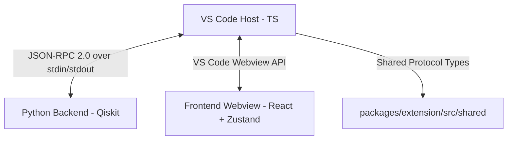

# QForge — Quantum Developer Tools

[](https://github.com/qforge/qforge)
[](LICENSE)

**QForge** is a production-grade Visual Studio Code extension designed to bring modern web development workflows to quantum computing. It provides live circuit visualization, comprehensive hover documentation, a step-by-step gate timeline, and deep statistical analysis directly inside the IDE.

---

## Key Features

### ⚛️ 1. Live Circuit Preview
No more compiling to matplotlib or saving image files. QForge parses your Python file in real time as you type and renders a high-fidelity SVG circuit diagram right beside your code.
* Supports common gates: H, X, Y, Z, S, T, CX, CZ, CCX, SWAP, Rx, Ry, Rz, U, etc.
* Fully reactive: Debounced parsing triggers on keystrokes.
* Interactive SVGs: Hover over gates to view mathematical details.

### 📚 2. Rich Hover Documentation
Get math intuition, physical realizations, and copy-pasteable Qiskit examples for 20+ quantum gates directly in your editor.
* Works offline, instantly.
* Zero Python environment dependencies for documentation lookups.

### 📅 3. Parallel Step Timeline
Understand execution order with a vertical gate-by-gate timeline. Gates executing in parallel are automatically grouped into time steps, making synchronization and depth bottlenecks obvious at a glance.

### 💡 4. Deep Circuit Analysis ("Explain Circuit")
Under the hood, QForge compiles your circuit into a Qiskit Directed Acyclic Graph (DAG) using a Python background process to extract:
* Circuit depth, total gate count, and two-qubit gate counts.
* Entanglement state verification.
* Rule-based pattern matching (e.g., automatically flags Bell States, GHZ States, Teleportation protocols, and VQE templates).

---

## Core Architecture

QForge is built as a modular monorepo using a **contract-first, decoupled** architecture:



### 1. The Two-Parser Strategy
To achieve instant UI responsiveness without blocking the main thread:
* **TypeScript Fast Path**: Uses a lightweight, regex-based abstract parser to extract basic circuit structure instantly on every keystroke.
* **Python Deep Path**: Invokes Qiskit's AST and DAG models in the background to calculate mathematical depth, entanglement properties, and transpiler suggestions.
* **Graceful Fallback**: If the user's Python environment lacks Qiskit, QForge automatically falls back to static AST analysis, ensuring the IDE never crashes.

### 2. High-Performance JSON-RPC 2.0 IPC
Rather than running local HTTP servers (which trigger firewalls and port conflicts), the extension host and Python backend communicate via **JSON-RPC 2.0 over standard I/O (stdin/stdout)**, mirroring the Language Server Protocol (LSP).

### 3. Native Theming (Zero-Flash UI)
The webview frontend reads VS Code's system variables (`--vscode-*`) directly. The theme adapts instantly when switching between Light, Dark, or High-Contrast VS Code themes without loading lag or custom javascript theme-listeners.

---

## Monorepo Layout

```
C:\QForge
├── packages/
│   ├── extension/         # VS Code Extension Host (TypeScript + esbuild)
│   ├── webview-ui/        # Webview Panel Frontend (React 18 + Zustand + Vite)
│   └── python/            # Python JSON-RPC Server & Qiskit Analyzer
├── tsconfig.base.json     # Global compiler config
└── package.json           # Workspace configurations
```

---

## Quick Start (Local Setup)

### Prerequisites
* [Node.js](https://nodejs.org/) (v18+)
* [Python](https://www.python.org/) (v3.9+)

### Installation
1. Clone the repository and install workspace dependencies:
   ```bash
   cd QForge
   npm install
   ```
2. Install Qiskit in your Python environment:
   ```bash
   pip install qiskit>=1.0
   ```

### Running & Debugging
1. Open the project in VS Code:
   ```bash
   code .
   ```
2. Press **F5** to launch the **[Extension Development Host]** sandbox window.
3. Open a python file (e.g. `test.py`) with a `QuantumCircuit`.
4. Press **`Ctrl+Shift+Q`** to view the live circuit canvas.

---

## Creator
Created and maintained by **Victorraj**.

## License
MIT License. Copyright (c) 2026 Victorraj.
